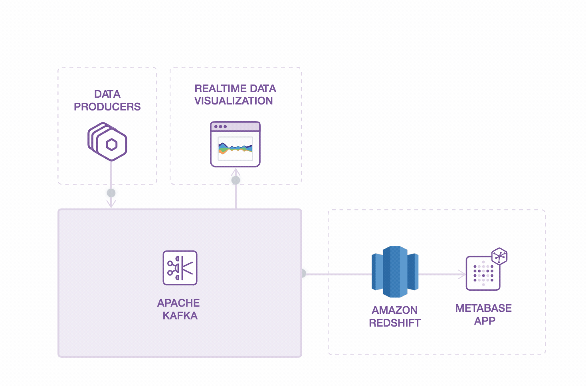

# Example Product/User Analytics System Using Apache Kafka, AWS RedShift, and Metabase

This is an example of a system that captures a large stream of product usage data, or events, and provides both real-time data visualization and SQL-based data analytics. The stream of events is captured by [Apache Kafka](https://kafka.apache.org/) and made available to other downstream consumers. In this example, there are two downstream consumers of the data. The data flowing through Kafka can be viewed in near real-time using a web-based data visualization app. The other consumer stores all the data in [AWS RedShift](https://aws.amazon.com/redshift/), a relational database that Amazon describes as "a fast, scalable data warehouse." Then we can query and visualize the data in RedShift from a SQL-compliant analytics tool. This example uses [Metabase deployed to Heroku](https://elements.heroku.com/buttons/metabase/metabase-deploy). [Metabase](https://www.metabase.com/) is an open-source analytics tool used by many organizations, large and small.

**This entire system can be deployed in 15 minutes -- most of that time spent waiting for Heroku and AWS to provision services -- and it requires very little ongoing operational maintenance.**

Here's an overview of how the system works.

<p align="center">
  
</p>

## Structure

This project includes 3 apps:

1. A data producer called `generate_data`. Data is simulated in this example, but this could be replaced with almost anything that produces data: a marketing website, a SaaS product, a point-of-sale device, a kiosk, internet-connected thermostat or car. And more than one data producer can be added.
1. A real-time data visualizer called `viz`, which shows relative volume of different categories of data being written into Kafka.
1. And a Kafka-to-RedShift writer called `reshift_batch`, which simply reads data from Kafka and writes it to RedShift.

They all share data using [Apache Kafka on Heroku](https://www.heroku.com/kafka).

You can optionally deploy Metabase to Heroku to query RedShift. Check out [Metabase's Heroku Deploy Button](https://elements.heroku.com/buttons/metabase/metabase).

## Deploy

### Prerequisites

- An AWS RedShift cluster. Check out [this Terraform script](https://github.com/heroku-examples/terraform-heroku-peered-redshift) for an easy way to create a RedShift cluster along with a Heroku Private Space and a private peering connection between the Heroku Private Space and the RedShift's AWS VPC. *Not free! This will incur cost on AWS and Heroku.*
- Node.js

### Deploy to Heroku

```shell
git clone git@github.com:heroku-examples/kafka-stream-viz.git
cd kafka-stream-viz
heroku create
heroku addons:create heroku-kafka:basic-0
heroku kafka:topics:create ecommerce-logs
heroku kafka:consumer-groups:create redshift-batch
heroku config:set KAFKA_TOPIC=ecommerce-logs
heroku config:set KAFKA_CONSUMER_GROUP=redshift-batch
heroku config:set FIXTURE_DATA_S3='s3://aws-heroku-integration-demo/fixture.csv'
git push heroku master
```

Alternatively, you can use the Heroku Deploy button:

[](https://heroku.com/deploy)

And then create the necessary Kafka topic and consumer group:

```shell
heroku kafka:topics:create ecommerce-logs #this can also be created at https://data.heroku.com/
heroku kafka:consumer-groups:create redshift-batch
```

Optionally, you can deploy Metabase to Heroku and use SQL to query and visualize data in RedShift. Use [Metabase's Heroku Deploy button](https://elements.heroku.com/buttons/metabase/metabase). Once deployed, you'll need to configure Metabase with the RedShift cluster URL, database name, username, and password.

### Deploy Locally

```shell
git clone git@github.com:heroku-examples/kafka-stream-viz.git
npm i
```

## Run

The following environment variables must be defined. If you used the Heroku deploy instructions above, all of the variables are already defined except for `DATABASE_URL`.

- `DATABASE_URL`: Connection string to an AWS RedShift cluster
- `FIXTURE_DATA_S3`: S3 path to CSV of fixture data to load into Redshift before starting data stream through Kafka (e.g. s3://aws-heroku-integration-demo/fixture.csv)
- `KAFKA_URL`: Comma-separated list of Apache Kafka broker URLs
- `KAFKA_CLIENT_CERT`: Contents of the client certificate (in PEM format) to authenticate clients against the broker
- `KAFKA_CLIENT_CERT_KEY`: Contents of the client certificate key (in PEM format) to authenticate clients against the broker
- `KAFKA_TOPIC`: Kafka topic the system will produce to and consume from
- `KAFKA_CONSUMER_GROUP`: Kafka consumer group name that is used by `redshift_batch` process type to write to Redshift.
- `KAFKA_PREFIX`: (optional) This is only used by [Heroku's multi-tenant Apache Kafka plans](https://devcenter.heroku.com/articles/multi-tenant-kafka-on-heroku) (i.e. `basic` plans)

Then in each of the `generate_data`, `viz`, and `redshift_batch` directories, run `npm start`.

Open the URL in the startup output of the `viz` app. It will likely be `http://localhost:3000`.
